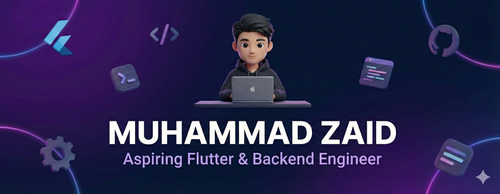

 

  I am a 3rd-semester Software Engineering student from Pakistan.  
  I combine <b>Java (OOP)</b> architecture with <b>Flutter</b> UI to build professional-grade mobile applications.

  
  

---

### 📖 Professional Summary
Passionate Software Engineering student and Flutter Specialist dedicated to building high-performance, scalable cross-platform mobile applications. Specialized in **Clean Architecture** and robust state management with **BLoC**, I focus on delivering fluid, production-ready user experiences. Currently advancing my expertise into the backend space by **learning Golang** to architect concurrent, high-efficiency services, while maintaining a foundation in **Firebase** and basic **Django** integrations.

---

### 🛠️ Technical Portfolio & Arsenal

| Category | Specialized Skills |
| :--- | :--- |
| **📱 Mobile Development** |    `Flutter Framework` `Dart Language` |
| **⚙️ Backend & Database** |    `Firebase` `Django (Basics)` `Supabase` `SQLite` |
| **💻 Programming Languages** |    `Java (OOP)` `Python` `Go (Golang - Learning)` |
| **🛠️ Developer Tools** |    `Git/GitHub` `VS Code` `Android Studio` `Postman` |

---

### 🎓 Education History
- **Bachelor of Science in Software Engineering** | *University of Central Punjab Lahore* | 2024 — 2028
- **Intermediate** | *Garrison College for Boys Lahore* | 2021 — 2023

---

### 🚀 Highlighted Projects
| Project | Tech Stack | Status | Repository |
| :--- | :--- | :--- | :--- |
| 
 **NexLinks**
 | `Flutter` `Firebase` `BLoC` |  | [View Repo](https://github.com/mzaid-dev/NexLinks) |
<!-- | 
💰 **Expense Tracker**
 | `Flutter` `BLoC` `SQLite` |  | [View Repo](https://github.com/mzaid-dev/Smart-Expense-Tracker) |
| 
🤖 **Sync AI**
 | `Flutter` `REST APIs` `AI` |  | [View Repo](https://github.com/mzaid-dev/Sync-AI) | -->

 

---

### 📊 GitHub Productivity

  
  

 

  
  <i>Engineered with focus on Scalability, Clean Code & Performance</i>

